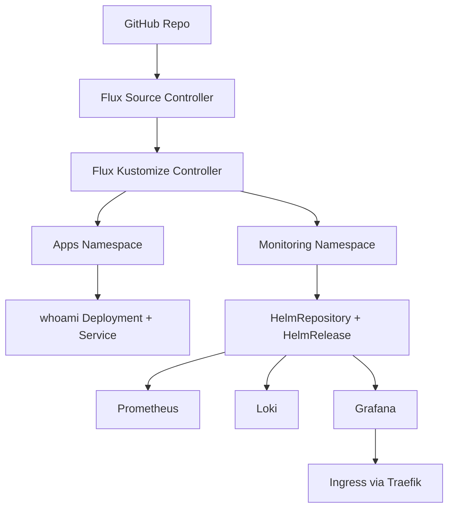

# FluxCD GitOps Demo

## Project Overview

This project demonstrates a lightweight GitOps platform using FluxCD on a local k3s cluster.
It deploys a sample application and a monitoring stack (Prometheus, Loki, Grafana) using declarative Kubernetes manifests and Helm releases managed by Flux.

## Architecture Diagram

## Repo Structure

- apps/whoami: sample application manifests.
- monitoring: HelmRepository, HelmRelease, and monitoring resources.
- ingress: ingress resources (Grafana endpoint).
- kustomization.yaml: top-level Flux reconciliation entrypoint.
- namespace.yaml: shared namespace bootstrap.

## GitOps Workflow

1. Changes are committed to Git.
2. Flux pulls repository updates.
3. Kustomize reconciles core manifests.
4. Flux Helm controller reconciles Helm releases for monitoring.
5. Cluster state converges to the desired state defined in this repository.

## Components

- whoami: simple demo workload.
- Prometheus stack: metrics collection and alerting components.
- Loki: log aggregation backend.
- Grafana: dashboards and visualization.
- Sealed Secrets: encrypted secret management for GitOps workflows.

## CI Pipeline Overview

GitHub Actions validates every pull request and push to main:

1. Build manifests with kustomize.
2. Validate schemas with kubeconform (including Flux CRDs).
3. Lint application manifests with kube-linter (blocking).
4. Render monitoring Helm charts and lint with kube-linter (advisory).

## Deployment

High-level deployment flow:

1. Bootstrap Flux on the cluster.
2. Point Flux to this repository.
3. Apply top-level kustomization.
4. Verify app, monitoring, and ingress resources reconcile successfully.

## Current Features

- GitOps-based app and monitoring deployment.
- Monitoring stack tuned for smaller local environments.
- CI manifest validation with schema and lint checks.
- Dedicated monitoring lint profile to reduce low-signal chart findings.

## Future Improvements

- Add environment overlays (dev/stage/prod style structure).
- Add alert routing and dashboard provisioning.
