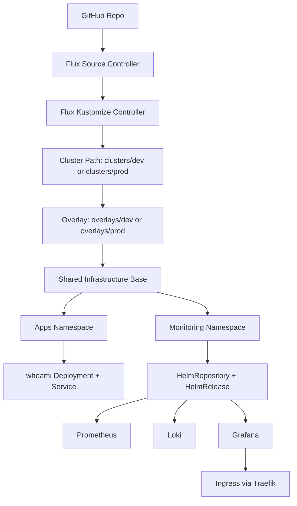

# FluxCD GitOps Demo

## Project Overview

This project demonstrates a lightweight GitOps platform using FluxCD on a local k3s cluster.
It deploys a sample application and a monitoring stack (Prometheus, Loki, Grafana) using declarative Kubernetes manifests and Helm releases managed by Flux.

## Architecture Diagram

## Repo Structure

- infrastructure: shared manifests (apps, secrets platform, monitoring, ingress).
- overlays/dev: environment-specific patches for dev.
- overlays/prod: environment-specific patches for prod.
- clusters/dev: cluster entrypoint for the dev environment.
- clusters/prod: cluster entrypoint for the prod environment.
- kustomization.yaml: default local entrypoint (currently points to dev cluster path).

## GitOps Workflow

1. Changes are committed to Git.
2. Flux pulls repository updates.
3. Each cluster reconciles its own path (`clusters/dev` or `clusters/prod`).
4. Cluster path resolves to an environment overlay.
5. Overlay applies patches on top of shared infrastructure.
6. Cluster state converges to the desired state defined in this repository.

## Components

- whoami: simple demo workload.
- Prometheus stack: metrics collection and alerting components.
- Loki: log aggregation backend.
- Grafana: dashboards and visualization.
- Vault + External Secrets foundation: centralized secret platform components.
- Sealed Secrets: currently still used for Grafana admin secret until migration phase.

## CI Pipeline Overview

GitHub Actions validates every pull request and push to main:

1. Build manifests with kustomize.
2. Validate schemas with kubeconform (including Flux CRDs).
3. Lint application manifests with kube-linter (blocking).
4. Render monitoring Helm charts and lint with kube-linter (advisory).

## Deployment

High-level deployment flow:

1. Bootstrap Flux on the cluster.
2. Point Flux to this repository and set the Kustomization path for that cluster.
3. Use `./clusters/dev` for development or `./clusters/prod` for production.
4. Verify app, monitoring, and ingress resources reconcile successfully.

## Build Commands

- Build dev cluster manifests:
    - `kustomize build clusters/dev`
- Build prod cluster manifests:
    - `kustomize build clusters/prod`

## Root Kustomization

- `kustomization.yaml` is intentionally a local default and currently targets `clusters/dev`.
- This is due to VM limitations and only one environment will be deployed at a time.

## Current Features

- GitOps-based app and monitoring deployment.
- Vault and External Secrets baseline deployed via Flux HelmReleases.
- Monitoring stack tuned for smaller local environments.
- CI manifest validation with schema and lint checks.
- Dedicated monitoring lint profile to reduce low-signal chart findings.

## Future Improvements

- Introduce Vault + External Secrets and migrate away from Sealed Secrets.
- Add Dagster as a realistic application stack with secrets integration.
- Add alert routing and dashboard provisioning.
