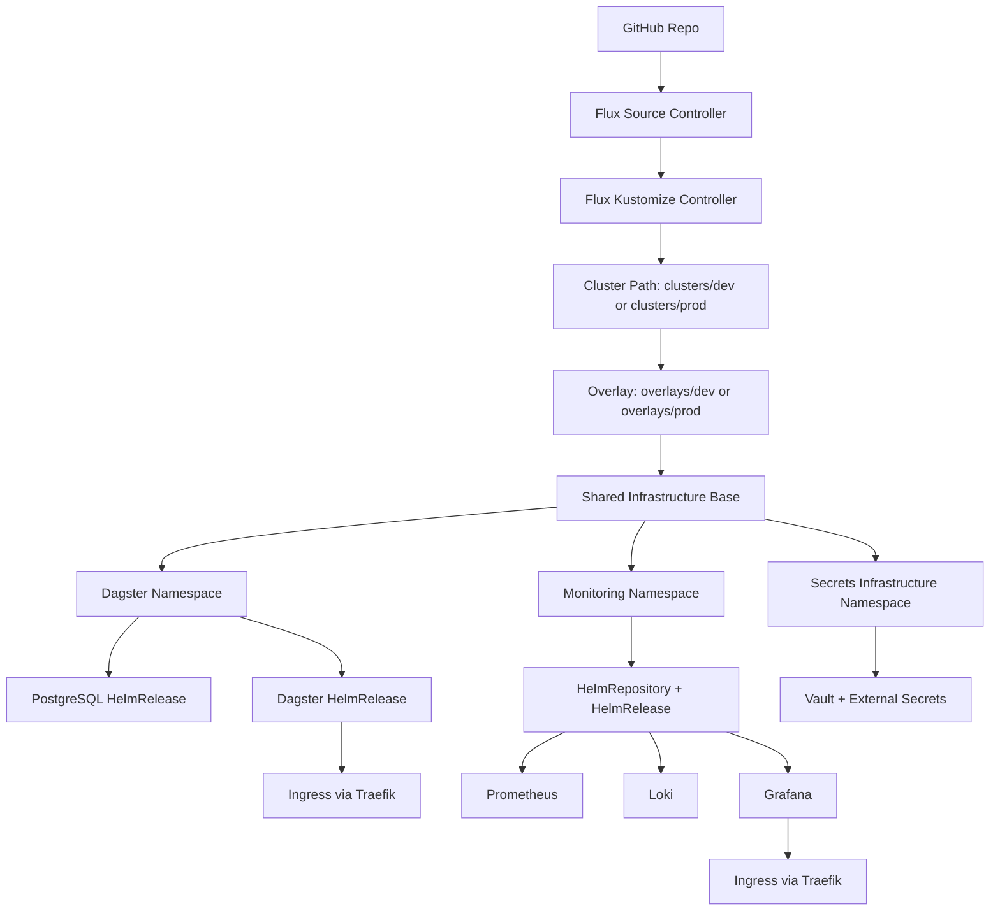

# FluxCD GitOps Demo

## Table of Contents

- [Project Overview](#project-overview)
- [Architecture Diagram](#architecture-diagram)
- [Prerequisites](#prerequisites)
- [Flux Bootstrap](#flux-bootstrap)
- [Repo Structure](#repo-structure)
- [GitOps Workflow](#gitops-workflow)
- [Components](#components)
- [CI Pipeline Overview](#ci-pipeline-overview)
- [Deployment](#deployment)
- [Vault Setup & Initialization](#vault-setup--initialization)
- [Bootstrapping Secrets via Vault](#bootstrapping-secrets-via-vault)
- [Monitoring Setup](#monitoring-setup)
- [Accessing Services](#accessing-services)
- [Build Commands](#build-commands)
- [Troubleshooting](#troubleshooting)
- [Teardown](#teardown)
- [Current Features](#current-features)
- [Scaling Considerations](#scaling-considerations)
- [Future Improvements](#future-improvements)

## Project Overview

This project demonstrates a lightweight GitOps platform using FluxCD on a local k3s cluster.
It deploys Dagster (a data orchestration platform) with PostgreSQL and a monitoring stack (Prometheus, Loki, Grafana) using declarative Kubernetes manifests and Helm releases managed by Flux.

## Architecture Diagram



## Prerequisites

Before deploying this repo, make sure you have:

- A Kubernetes cluster. I used a local K3s cluster.
- `kubectl` configured to talk to that cluster.
- `flux` CLI, for bootstrapping and managing Flux.
- `kustomize`, for building manifests locally.
- `helm` (used indirectly via Flux HelmReleases, but useful for local debugging).
- Access to the GitHub repository Flux will sync from, and a GitHub personal access token (PAT) with repo permissions (needed for `flux bootstrap`).
- Note: Tested on a single local VM (Debian) with 4 vCPUs / 16GB RAM / 50GB disk.

## Flux Bootstrap

Flux needs to be bootstrapped once per cluster. Bootstrapping installs the Flux controllers, connects them to this repository, and writes a deploy key back to GitHub so Flux can pull updates.

```bash
export GITHUB_TOKEN=<YOUR_GITHUB_PAT>

flux bootstrap github \
  --owner=<GITHUB_OWNER> \
  --repository=<REPO_NAME> \
  --branch=main \
  --path=clusters/dev \
  --personal
```

- Set `--path` to `clusters/dev` or `clusters/prod` depending on which environment you're bootstrapping (see [Repo Structure](#repo-structure) for what each path resolves to).
- `--personal` is used here because this is a personal GitHub repo rather than an organization; drop it if bootstrapping against an org-owned repo.
- The token only needs to be present in your shell for this step, it isn't stored in the cluster. Long-term repo access is instead handled by an SSH deploy key that flux bootstrap generates: the private key is stored as a Kubernetes Secret (flux-system/flux-system) and used by the Source Controller on every reconcile, while the public key is registered as a deploy key on the GitHub repo.

Verify the bootstrap succeeded:

```bash
flux check
flux get kustomizations
```

You should see the `flux-system` Kustomization and the cluster path Kustomization both reporting `Ready: True`.

## Repo Structure

- apps: application workloads (currently Dagster and its PostgreSQL dependency).
- infrastructure: shared platform manifests (secrets platform and monitoring).
- overlays/dev: environment-specific patches for dev.
- overlays/prod: environment-specific patches for prod.
- clusters/dev: cluster entrypoint for the dev environment.
- clusters/prod: cluster entrypoint for the prod environment.
- kustomization.yaml: local default entrypoint. It's intentionally hardcoded to `clusters/dev` because this demo runs on a single VM and only one environment is deployed at a time (see [Scaling Considerations](#scaling-considerations) for how this changes with real multi-node capacity).

## GitOps Workflow

1. Changes are committed to Git.
2. Flux pulls repository updates.
3. Each cluster reconciles its own path (`clusters/dev` or `clusters/prod`).
4. Cluster path resolves to an environment overlay.
5. Overlay composes shared `apps/` + `infrastructure/` and applies environment patches.
6. Cluster state converges to the desired state defined in this repository.

## Components

- Dagster: Data orchestration platform with PostgreSQL backend, backed by a Vault-synced secret.
- Prometheus stack: Metrics collection and alerting components.
- Loki: Log aggregation backend.
- Grafana: Dashboards and visualization with provisioned Prometheus/Loki datasources.
- Vault + External Secrets: Centralized secret platform; backs Grafana admin credentials and Dagster's PostgreSQL password.

### Dagster User Deployments

- The Dagster user deployment is defined in Helm values under `dagster-user-deployments.deployments`.
- The deployment entry uses `dagsterApiGrpcArgs` with `--python-file /example_project/example_repo/repo.py`.
- That file path is resolved inside the user-code container image (`docker.io/dagster/user-code-example:1.13.12`), not from this GitOps repository.
- If you switch to a custom image, keep the file path valid in the image or change the Dagster API args (for example to a module-based entrypoint).

## CI Pipeline Overview

GitHub Actions validates every pull request and push to main:

1. Build manifests with kustomize.
2. Validate schemas with kubeconform (including Flux CRDs).
3. Lint application manifests with kube-linter (blocks merge).
4. Render monitoring Helm charts and lint with kube-linter (advisory).

## Deployment

High-level deployment flow:

1. Complete [Flux Bootstrap](#flux-bootstrap) on the cluster.
2. Confirm the Kustomization path matches the environment you intend to run (`./clusters/dev` for development or `./clusters/prod` for production).
3. Verify app, monitoring, and ingress resources reconcile successfully.
4. Continue to [Vault Setup & Initialization](#vault-setup--initialization) to bring up the secrets platform.
5. Complete [Bootstrapping Secrets via Vault](#bootstrapping-secrets-via-vault) for each app (Grafana, Dagster) before their ExternalSecrets can sync.
6. Expect Dagster, PostgreSQL, and Grafana to show as unhealthy (`CrashLoopBackOff` or `Pending`) until step 5 is complete they depend on the secrets bootstrapped there to start.
> The namespace, SecretStore, and ExternalSecret are created automatically by Flux and don't depend on the vault secret existing. However, until the vault secret bootstrapping is completed, the pods will not be able to start in a healthy state.

## Vault Setup & Initialization

- Vault must be initialized the first time it is deployed.
- Keep the output from the initialization step somewhere safe. It includes 5 unseal keys and 1 initial root token.
- If the vault is sealed and you lose the 5 unseal keys, you will not be able to recover anything stored in it, and will have to delete the storage for the vault and start fresh again. If the vault is unsealed and running, it will still function until a reseal event happens.

Initialize Vault:

```bash
kubectl -n secrets-infrastructure exec -it vault-0 -- vault operator init
```

Unseal Vault with any 3 of the 5 unseal keys:

```bash
kubectl exec -n secrets-infrastructure vault-0 -- vault operator unseal '<UNSEAL_KEY>'
```

### If you lose access

- **Still have at least 3 unseal keys?** Just run the unseal command again and the vault will unseal normally.
- **Lost the root token but still have your unseal keys?** Use `vault operator generate-root` detailed in the Hashicorp docs to regenerate one.
- **Lost the unseal keys entirely?** There's no real recovery path. The vault's design intentionally makes this unrecoverable without them, since the unseal keys are what protect the encryption key. If the vault is still unsealed and you still have access, it will keep functioning normally until the next reseal event so read out and back up any secrets you need immediately, before that happens. Once it's sealed again (or restarted), it's gone for good. At that point, you will need to delete the storage and start fresh:

```bash
kubectl -n secrets-infrastructure delete pod vault-0
kubectl -n secrets-infrastructure delete pvc data-vault-0
```

This wipes Vault data and you will need to do a fresh initialization.

## Bootstrapping Secrets via Vault

Any application secret synced onto the cluster via External Secrets follows this pattern:
- Write the secret to the vault
- Create a scoped read policy
- Issue a token for that policy
- Drop the token into the target namespace so the ExternalSecret/SecretStore can pull from the vault

The steps are the same for any namespace secret just swap, the app name, Vault path, policy name, and namespace.

> Before starting, make sure the target namespace and the app's manifests (including its SecretStore and ExternalSecret) have already been applied by Flux. Steps 6 and 7 below require the namespace to exist and the ExternalSecret to already be defined if Flux hasn't reconciled the app yet, those steps will fail with a "not found" error rather than anything Vault-related.

General steps:

1. Log in to the vault with an admin token:

```bash
kubectl -n secrets-infrastructure exec -it vault-0 -- vault login <VAULT_ADMIN_TOKEN>
```

2. Ensure KV v2 is enabled at `secret/` (This only needs to be done once per cluster, not per app):

```bash
kubectl -n secrets-infrastructure exec -it vault-0 -- vault secrets enable -path=secret kv-v2
```

3. Write the app's credentials to the vault path scoped to that app:

```bash
kubectl -n secrets-infrastructure exec -it vault-0 -- \
    vault kv put secret/<APP_NAME> <KEY>=<VALUE> <KEY2>=<VALUE2>
```

4. Create a read policy scoped to that app's vault path:

```bash
kubectl -n secrets-infrastructure exec -it vault-0 -- sh -lc "cat <<'EOF' > /tmp/eso-<APP_NAME>.hcl
path \"secret/data/<APP_NAME>\" {
    capabilities = [\"read\"]
}
EOF
vault policy write eso-<APP_NAME> /tmp/eso-<APP_NAME>.hcl"
```

5. Create a token for that policy and copy `auth.client_token` from the output:

```bash
kubectl -n secrets-infrastructure exec -it vault-0 -- \
    vault token create -policy=eso-<APP_NAME> -format=json
```

6. Create the Kubernetes Secret expected by the SecretStore in the app's namespace:

```bash
kubectl -n <APP_NAMESPACE> create secret generic vault-token \
    --from-literal=token='<CLIENT_TOKEN>'
```

7. Verify synchronization:

```bash
kubectl -n <APP_NAMESPACE> get externalsecret <APP_NAME>-<SECRET_NAME>
kubectl -n <APP_NAMESPACE> describe externalsecret <APP_NAME>-<SECRET_NAME>
kubectl -n <APP_NAMESPACE> get secret <APP_NAME>-<SECRET_NAME>
```

Notes:

- The SecretStore points to `http://vault.secrets-infrastructure.svc.cluster.local:8200`.
- Each ExternalSecret reads its own vault key (e.g. `secret/<APP_NAME>`) and expects the corresponding properties to exist at that path.
- Do not commit vault tokens or generated passwords into Git.
- A separate vault token per app (as opposed to one shared token/policy for everything) keeps blast radius small if one token leaks; this is why each app gets its own policy and token rather than reusing a single admin token.

### Application-Specific Values

Apply the generic steps above with these values for each app:

| App | Vault path | Properties | Policy name | Namespace | Secret name |
|-----|-----------|-----------|-------------|-----------|-------------|
| Grafana | `secret/grafana` | `admin-user`, `admin-password` | `eso-grafana` | `monitoring` | `grafana-admin` |
| Dagster | `secret/dagster/postgres` | `password` (app user), `admin-password` (superuser) | `eso-dagster` | `dagster` | `dagster-postgresql` |

### Example: Grafana

Concrete values for bootstrapping the Grafana admin secret, using the pattern above:

```bash
# 1. Log in
kubectl -n secrets-infrastructure exec -it vault-0 -- vault login <VAULT_ADMIN_TOKEN>

# 2. Write credentials
kubectl -n secrets-infrastructure exec -it vault-0 -- \
    vault kv put secret/grafana admin-user=admin admin-password='<STRONG_PASSWORD>'

# 3. Create read policy
kubectl -n secrets-infrastructure exec -it vault-0 -- sh -lc "cat <<'EOF' > /tmp/eso-grafana.hcl
path \"secret/data/grafana\" {
    capabilities = [\"read\"]
}
EOF
vault policy write eso-grafana /tmp/eso-grafana.hcl"

# 4. Create token
kubectl -n secrets-infrastructure exec -it vault-0 -- \
    vault token create -policy=eso-grafana -format=json

# 5. Create the Kubernetes Secret in the monitoring namespace
kubectl -n monitoring create secret generic vault-token \
    --from-literal=token='<CLIENT_TOKEN>'

# 6. Verify
kubectl -n monitoring get externalsecret grafana-admin
kubectl -n monitoring describe externalsecret grafana-admin
kubectl -n monitoring get secret grafana-admin
```

## Monitoring Setup

Grafana is deployed as a standalone HelmRelease and is configured to use in-cluster datasources rather than chart-managed embedded Grafana instances from the Prometheus or Loki charts.

Current setup:

- Prometheus datasource is provisioned to `http://kube-prometheus-stack-prometheus.monitoring.svc.cluster.local:9090`.
- Loki datasource is provisioned to `http://loki.monitoring.svc.cluster.local:3100`.
- Datasources are loaded from `infrastructure/monitoring/datasources/datasources.yaml`.
- Dashboards are loaded from files under `infrastructure/monitoring/dashboards/`.
- Kustomize generates ConfigMaps for both datasources and dashboards.
- Grafana sidecars watch labeled ConfigMaps in namespace `monitoring` and load them automatically.

Current dashboard scope:

- `stack-health.json` is a platform-health dashboard.
- It focuses on node and container health, storage, network, and namespace-scoped logs.
- Namespace filtering is sourced from `kube_pod_info` so all active namespaces (including `dagster`) appear even when they are not Prometheus scrape targets.
- Application-level RED (Rate, Errors, and Duration) panels for Dagster can be added once Dagster's metrics endpoints and scrape config are defined.

## Accessing Services

Once an app's Flux Kustomization has reconciled and any secrets it depends on are synced, you can reach it via its Traefik ingress:

```bash
kubectl -n <APP_NAMESPACE> get ingress
```

- Use the hostname/address from the ingress output to open the app in a browser. This works the same way for Grafana (`monitoring` namespace) and Dagster (`dagster` namespace).
- If the app requires login (e.g. Grafana), use the credentials you wrote to Vault for that app in [Bootstrapping Secrets via Vault](#bootstrapping-secrets-via-vault).

## Build Commands

These commands are useful in building and debugging the manifests locally before committing changes to your repository.

- Build dev cluster manifests:
    - `kustomize build clusters/dev`
- Build prod cluster manifests:
    - `kustomize build clusters/prod`

## Troubleshooting

Common issues when running this demo:

- **Flux Kustomization not reconciling:** check `flux get kustomizations` for the failure reason, then `flux logs --level=error` for details.
- **HelmRelease stuck in a non-ready state:** `flux get helmreleases -A` to see status, then `kubectl -n monitoring describe helmrelease <name>` for the underlying error.
- **ExternalSecret not syncing:** confirm the `vault-token` Secret exists in the relevant namespace and hasn't expired, and that the Vault policy still grants read access to the correct path (e.g. `secret/data/grafana` for monitoring, `secret/data/dagster/postgres` for dagster).
- **Dashboard or datasource not showing up in Grafana:** confirm the generated ConfigMaps are present in `monitoring`, the Grafana sidecars are enabled, and the relevant files are still referenced by `infrastructure/monitoring/kustomization.yaml`.
- **Vault sealed after a pod restart:** this is expected with manual unseal see [Vault Setup & Initialization](#vault-setup--initialization) to unseal again.

## Teardown

To tear down the local demo:

```bash
flux uninstall --namespace=flux-system
```

- This removes the Flux controllers and their CRDs but does not delete the workloads Flux deployed; those need to be removed separately (e.g. `kubectl delete namespace monitoring apps secrets-infrastructure`) if you want a full clean slate.
- If you're discarding the whole VM/cluster rather than reusing it, you can skip the above and just destroy the VM/cluster directly.

## Current Features

- GitOps-based Dagster and monitoring deployment via Flux.
- Dagster with external PostgreSQL backend, credentials managed via Vault + External Secrets.
- Prometheus, Loki, and Grafana stack with cross-datasource dashboards.
- Grafana admin credentials synced from Vault.
- Monitoring stack tuned for smaller local environments.
- CI manifest validation with schema and lint checks (kustomize, kubeconform, kube-linter).
- Separate environment overlays (dev and prod) with Traefik ingress.
- Environment-specific Dagster and PostgreSQL sizing via overlay patches (for example, higher prod replicas/resources and larger prod PostgreSQL persistence).

## Scaling Considerations

This repo is intentionally scoped as a single-node local demo. The sections below outline what would need to change to run this pattern reliably at production/enterprise scale. None of this is implemented here, it's a reference for evolving the setup.

### Compute

- Move from a single VM to a real multi-node cluster with multiple control-plane nodes (always an odd number for etcd quorum) or a managed control plane.
- Rough starting sizing: 4 vCPU / 16GB RAM per worker node running this stack; control-plane-only nodes can be smaller (2 vCPU / 8GB).
- k3s supports HA via embedded etcd or an external datastore and can still be used here. However, a full k8s cluster would be recommended for anything beyond a lightweight demo setup.
- With real multi-node capacity, dev and prod no longer need to share a single environment; they can run as separate clusters, or isolated node pools/namespaces with real resource guarantees, each with Flux reconciling its own path concurrently.

### Vault

- Single Vault pod and PVC is not production-viable. Run Vault in HA mode with integrated Raft storage across 3+ replicas, or back it with a supported external storage backend.
- Replace manual `vault operator unseal` with auto-unseal via a cloud KMS (AWS KMS, Azure Key Vault, GCP KMS). This also removes most of the manual key-management risk currently documented in [Vault Setup & Initialization](#vault-setup--initialization).
- Define a real break-glass/recovery process (e.g. a documented root token rotation and a designated set of key holders) instead of relying on destructive PVC resets.

### Storage

- Local-path storage is fine for a demo, but not reliable for a real/production implementation.
- For production, use durable storage that survives node failures (cloud disks via CSI or a distributed storage platform on-prem).
- Vault should be replicated and backed up with regular snapshots.

### Monitoring stack

- Prometheus RAM usage is driven primarily by retention and metric cardinality. At scale, use remote-write into a long-term store (Thanos) rather than relying on local Prometheus retention.
- Loki similarly can benefit from a long-term storage backend instead of local disk once log volume grows.

### Networking / ingress

- Replace single-node Traefik exposure with a real LoadBalancer so ingress doesn't depend on one node's availability.

### CI/CD implications

- The existing CI pipeline (kustomize build, kubeconform, kube-linter) still applies, but at scale you'd likely add environment-specific policy checks before promoting manifests to prod.

## Future Improvements

- Add Prometheus scrape config for Dagster metrics and RED-style dashboards.
- Implement alert routing and runbook provisioning for platform health alerts.
- Extend Dagster with custom user code containers and additional assets.
- Add multi-cluster support with separate Flux reconciliation paths per cluster.
