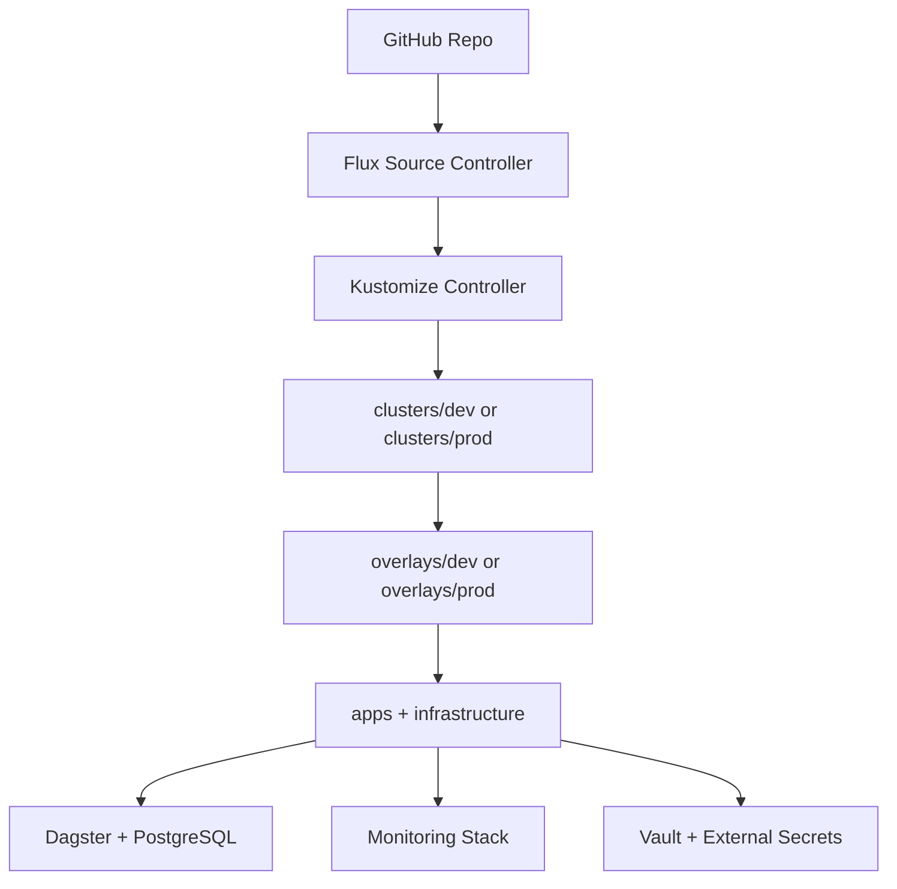

# Architecture

This page explains the topology and design choices behind the platform deployed by this repo. Each major component was chosen deliberately, with a specific trade-off accepted in exchange for the properties that mattered most: reproducibility, secret hygiene, and clear environment separation. Where a decision was rejected in favor of a simpler alternative, that reasoning is documented too.

## Problem Statement

Build a reproducible GitOps platform that can run locally but still demonstrate production-relevant patterns:

- **Environmental separation** - dev and prod can reconcile independently, with isolated state and sizing.
- **Declarative app and infrastructure management** - all cluster state is defined in Git and applied via Flux, with no resources applied manually.
- **Secret handling outside Git** - credentials are managed through Vault and synced at runtime and never committed. See [vault.md](vault.md#threat-model-assumptions) for the specific threat model this design assumes.
- **Observability platform behavior** - metrics, logs, and dashboards are continuously available, with provisioning kept in sync via reconciliation.

## Reconciliation Flow

## Design Decisions

### Decision 1: Environment Entry Points

- Implemented in [clusters/dev/kustomization.yaml](../clusters/dev/kustomization.yaml) and [clusters/prod/kustomization.yaml](../clusters/prod/kustomization.yaml).
- Why: each cluster can reconcile a dedicated path with minimal branching logic.
- Why only two environments: due to resource limitations on the virtual machine, only one environment can be run at a time (see [Current Limitations](../README.md#current-limitations)), so dev and prod are enough to demonstrate environment separation without added complexity a staging tier wouldn't add value to at this scale.
- Trade-off: additional path maintenance when environments diverge.

### Decision 2: Overlay-Based Environment Tuning

- Implemented in [overlays/dev/kustomization.yaml](../overlays/dev/kustomization.yaml) and [overlays/prod/kustomization.yaml](../overlays/prod/kustomization.yaml).
- Why: a shared base with environment-specific patches makes the differences between dev and prod explicit and diffable in Git, rather than duplicated across two full copies of the manifests.
- Trade-off: as overlays grow, patches can become numerous enough that understanding the fully-resolved state of an environment requires mentally merging several files rather than reading one.

### Decision 3: HelmRelease for Stateful Components

- Dagster and PostgreSQL defined in [apps/dagster/dagster-release.yaml](../apps/dagster/dagster-release.yaml) and [apps/dagster/postgres-release.yaml](../apps/dagster/postgres-release.yaml).
- Why: chart versions are pinned explicitly in Git, so upgrades happen by committing a version bump rather than running `helm upgrade` manually against the cluster.
- Trade-off: diagnosing an issue often requires understanding the chart's internal templates and values structure, not just the application itself.

### Decision 4: Vault + External Secrets

- Vault and controller defined in [infrastructure/secrets-infrastructure/vault-release.yaml](../infrastructure/secrets-infrastructure/vault-release.yaml) and [infrastructure/secrets-infrastructure/external-secrets-release.yaml](../infrastructure/secrets-infrastructure/external-secrets-release.yaml).
- Why: credentials live in Vault instead of Git, and each app namespace only has read access to its own secret path via a scoped policy, meaning no app can read another app's secrets.
- Trade-off: more components to operate than static Kubernetes secret: the vault itself, the External Secrets controller, and a policy/token pair per app. Onboarding a new app also requires a manual bootstrap step (writing the secret to Vault, creating its policy and token) before its pods can start, rather than the secret being available immediately as part of the app's own manifests.

### Decision 5: Traefik for Ingress

- Ingress resources defined per app, routed through Traefik.
- Why: Traefik ships as k3s's default ingress controller, so no additional controller needed to be installed or maintained for this demo.
- Trade-off: ties the ingress layer to k3s's defaults; a production or non-k3s cluster would need an explicit ingress controller decision (see [scaling.md](scaling.md)).

### Decision 6: Dagster as the Demo Application

- Dagster deployed with a PostgreSQL backend, defined in [apps/dagster/dagster-release.yaml](../apps/dagster/dagster-release.yaml).
- Why: a real data orchestration platform with a stateful database dependency gives the Vault, External Secrets, and monitoring integrations something realistic to protect and observe, rather than a stateless placeholder workload with no actual secrets or persistence to manage.
- Trade-off: Dagster is a heavier workload than the platform strictly needs to demonstrate GitOps mechanics, and its user-code deployment model (see below) adds a layer of configuration specific to Dagster rather than generic to any app.

## Repository Layout

- clusters/dev: entrypoint for development reconciliation.
- clusters/prod: entrypoint for production reconciliation.
- overlays/dev: composes shared resources with dev patching.
- overlays/prod: composes shared resources with prod patching.
- apps: application workloads (Dagster and PostgreSQL).
- infrastructure: shared infrastructure, including monitoring and secrets platform.
- docs: architecture, setup, and operational documentation (this page and its siblings).

## Environment Model

Only one environment runs at a time on this local setup. However, both overlays are fully defined in Git, but the root `kustomization.yaml` points to a single active path (see [Repository Layout](#repository-layout)).

Both overlays currently compose:
- apps
- infrastructure
- infrastructure/monitoring
- ingress resources for Dagster and Grafana

Both overlays patch:
- Dagster HelmRelease values
- PostgreSQL HelmRelease values

Primary difference is sizing strategy:
- Dev keeps lower resource allocations.
- Prod increases resource limits, especially for Dagster and PostgreSQL persistence.

## Rejected Alternatives

- Separate repository per environment: rejected because it increases coordination cost and weakens cross-environment diff visibility.
- Plain Kubernetes Secret manifests in Git: rejected because it conflicts with secret hygiene and security goals.
- Embedded Grafana from monitoring charts: rejected to preserve control over datasource and dashboard provisioning behavior.

## Dagster User-Code Container Note

Dagster user deployment points to an image-based Python entrypoint:
- image: docker.io/dagster/user-code-example:1.13.12
- dagsterApiGrpcArgs: --python-file /example_project/example_repo/repo.py

That path must exist inside the container image; it is not loaded from this repository.

## Verification Anchors

- Overlay behavior: compare [overlays/dev/patches/dagster-release.yaml](../overlays/dev/patches/dagster-release.yaml) with [overlays/prod/patches/dagster-release.yaml](../overlays/prod/patches/dagster-release.yaml).
- Monitoring stack declarations: [infrastructure/monitoring/releases.yaml](../infrastructure/monitoring/releases.yaml).

## Next Reads

- Setup and bootstrap: [getting-started.md](getting-started.md)
- Secret lifecycle and app credentials: [vault.md](vault.md)
- Monitoring internals: [monitoring.md](monitoring.md)
- CI validation strategy: [ci.md](ci.md)
- Production scaling path: [scaling.md](scaling.md)
- Common failures and recovery: [troubleshooting.md](troubleshooting.md)
